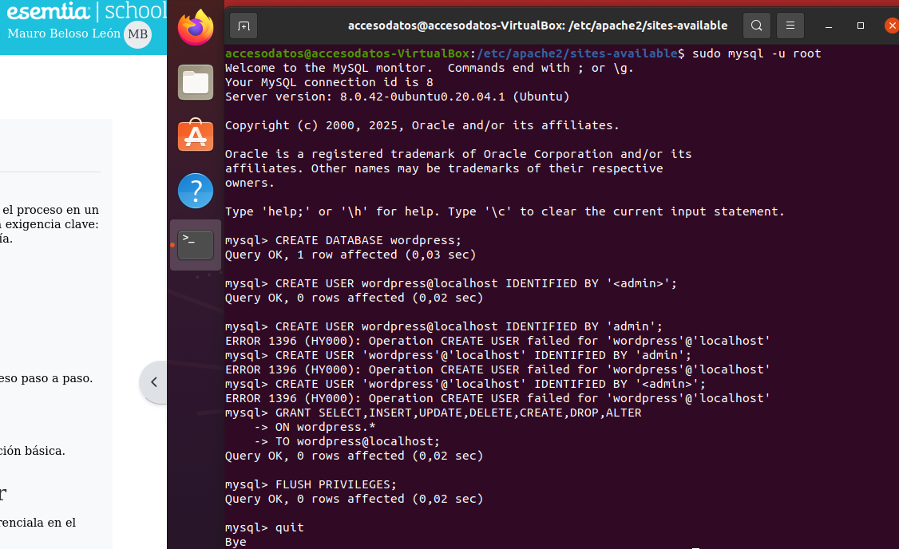
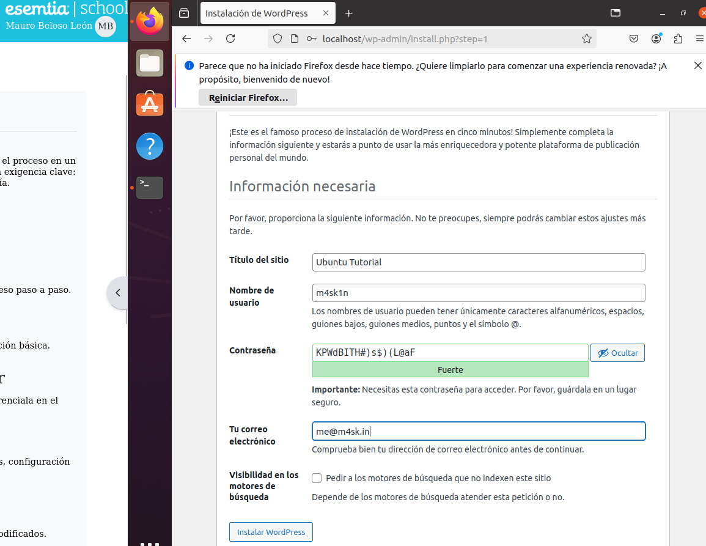

# Instalación y configuración de WordPress en Ubuntu

Para instalar y confi                                                                                                                                                                                                                                                                                                                                                                                                                                                                                                   gurar wordpress en una máquina virtual Ubuntu debemos seguir los siguientes pasos:

Para poder instalar PHP y Apache, debemos escribir en la terminal el siguiente comando.

                                                                     

A continuación debemos crear el directorio de instalación y descargar el archivo de WordPress.org, para eso escribimos el siguiente comando.

Ahora debemos crear el sitio de apache para WordPress. Primero accedemos a la configuración con el siguiente comando y escribimos nuestra contraseña.

 

Y a continuación escribimos lo siguiente.

A continuación escribimos los siguientes comandos para configurarlo y al finalizar recargamos apache2 para aplicar los cambios.

Ahora crearemos la base de datos.

Ahora debemos configurar Wordpress para usar esta base de datos con los siguientes comandos:

sudo -u www-data cp /srv/www/wordpress/wp-config-sample.php /srv/www/wordpress/wp-config.php
sudo -u www-data sed -i 's/database_name_here/wordpress/' /srv/www/wordpress/wp-config.php
sudo -u www-data sed -i 's/username_here/wordpress/' /srv/www/wordpress/wp-config.php
sudo -u www-data sed -i 's/password_here/<your-password>/' /srv/www/wordpress/wp-config.php

Finalmente en una sesión terminal abrimos el archivo de configuración en nano, donde buscamos las siguientes líneas y las borraremos. 

Ahora abrimos http:/localhost en nuestro navegador y rellenamos nuestros datos. 

Al iniciar sesión, entramos en el icono de post, y accedemos a all posts. 

Situamos el ratón sobre “Hola” y lo borramos.
Creamos un nuevo archivo y lo publicamos. 

