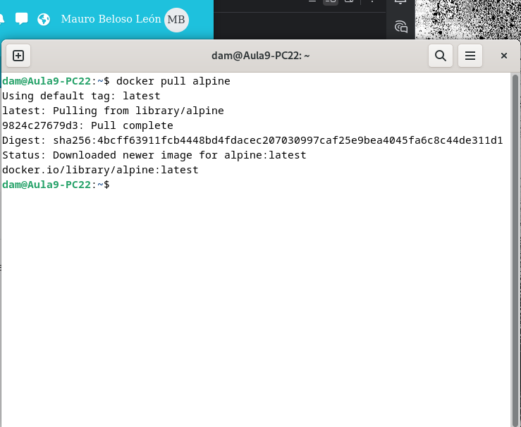
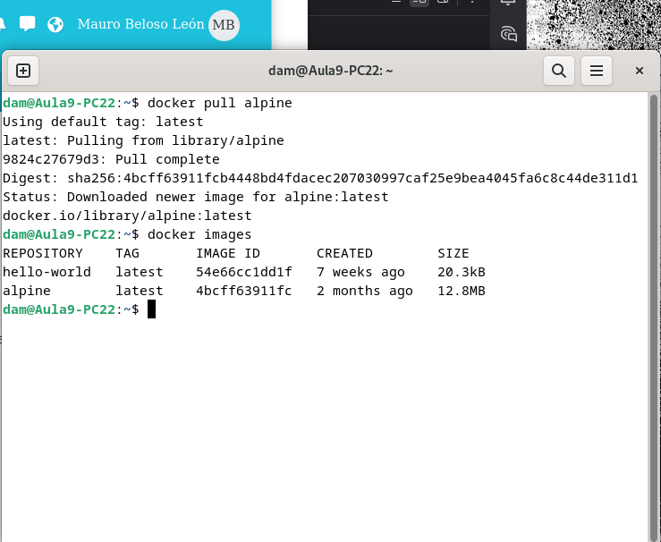
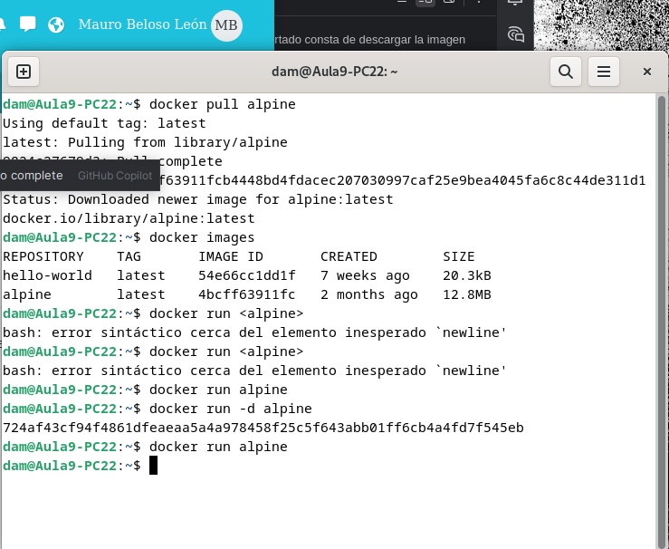
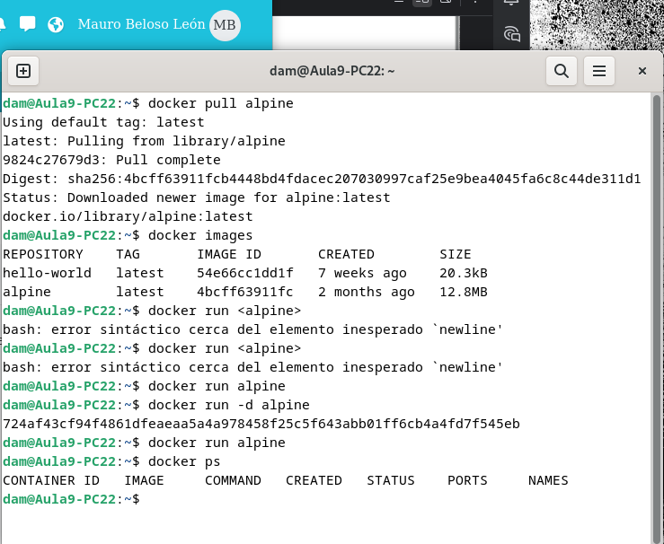
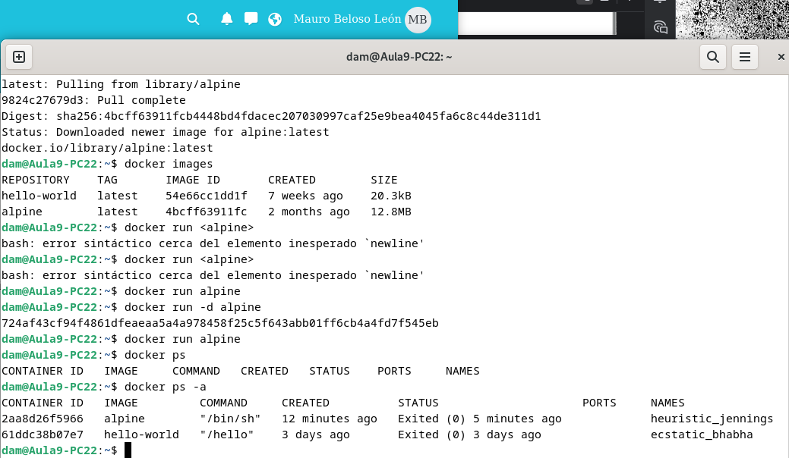
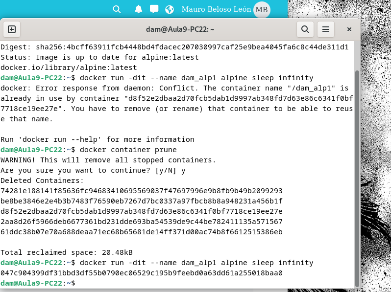
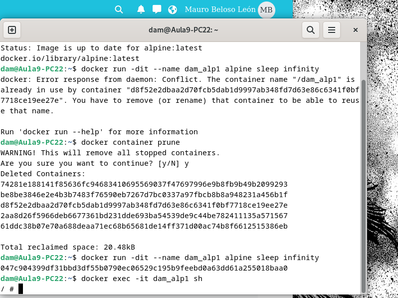

El primer apartado consta de descargar la imagen "alpine",para eso usamos por terminal el comando siguiente:

Y para comprobar que esta se encuentra el equipo ejecutamos el comando:

El segundo apartado es crear un contenedor sin asignarle un nombre.

Este contenedor adquiere autimaticamente un nombre aleatorio, y para comprobar si está en ejecución o no ejecutamos el siguiente comando que nos muestra los contenedores activos, el cual está vacío

Para obtener el nombre usamos el siguiente comando que muestra todos los contenedores:

Para el tercer apartado creamos un contenedor llamado dam_alp1

Para acceder a ella primero debemos iniciarla y después introducir el siguiente comando

