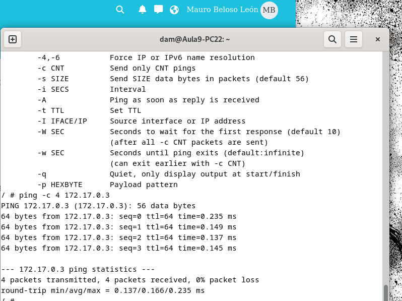
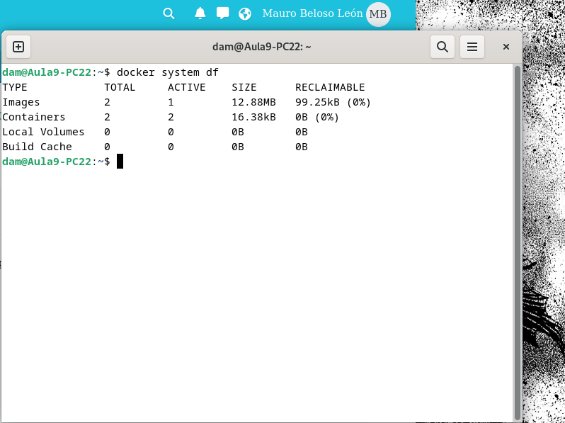

El primer apartado consta de descargar la imagen "alpine",para eso usamos por terminal el comando siguiente:

Y para comprobar que esta se encuentra el equipo ejecutamos el comando:

El segundo apartado es crear un contenedor sin asignarle un nombre.

Este contenedor adquiere autimaticamente un nombre aleatorio, y para comprobar si está en ejecución o no ejecutamos el siguiente comando que nos muestra los contenedores activos, el cual está vacío

Para el apartado 3 debemos crear un contenedor llamado dam_alp1 y acceder a el. Para ello debemos crear un contenedor y usamos el comando infinity para que se ejecute continuamente.

Para acceder al contenedor usamos el siguiente comando. Si estamos dentro de el, aparecerá el símbolo "#". Para salir de este ejecutamos ctrl + P y ctrl + Q

Para comprobar la ip ejecutamos el siguiente comando

Para usar el comando ping debemos ejecutar primero el contenedor y después usar el comando ping

En el quinto apartado nos pide crear otro contenedor y hacer ping entre estos. Para ello creamos el contenedor y buscamos su IP

Para ejecutar ping, debemos ejecutar el primer contenedor y dentro ejecutar ping con la ip del segundo contenedor

Para salir de la terminal ejecutamos exit. Con respecto al contenedor, debido al comando infinity, este se seguirá ejecutando.

Para saber cuanta memoria en el disco duro se ocupó ejecutamos el siguiente comando

Por último para ver la RAM que ocupan, usamos el comando docker stats

